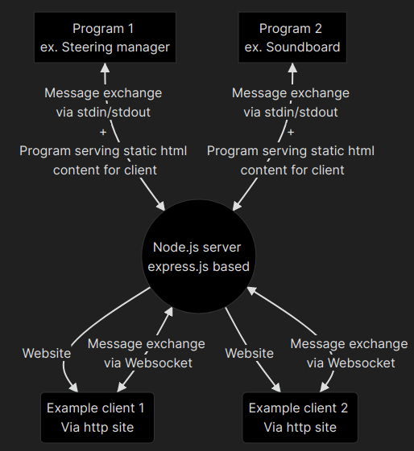

# Main docs page

Here will be docs :)

## Communication schema

Node.js server is the heart of the whole communication process. It's purpose is to receive information from client and send it to program and the other way around. Message structure send between them is defined in [messages](messages.md) document.

## More specific communication schema
### Request from client
1. Client sends request to the server via websocket.
2. Server receives message, extracts program name (returns error when it is invalid) and send request to program.
3. Program receives message and send response message to the server using stdout and stdin.
4. Server transmits message back.
